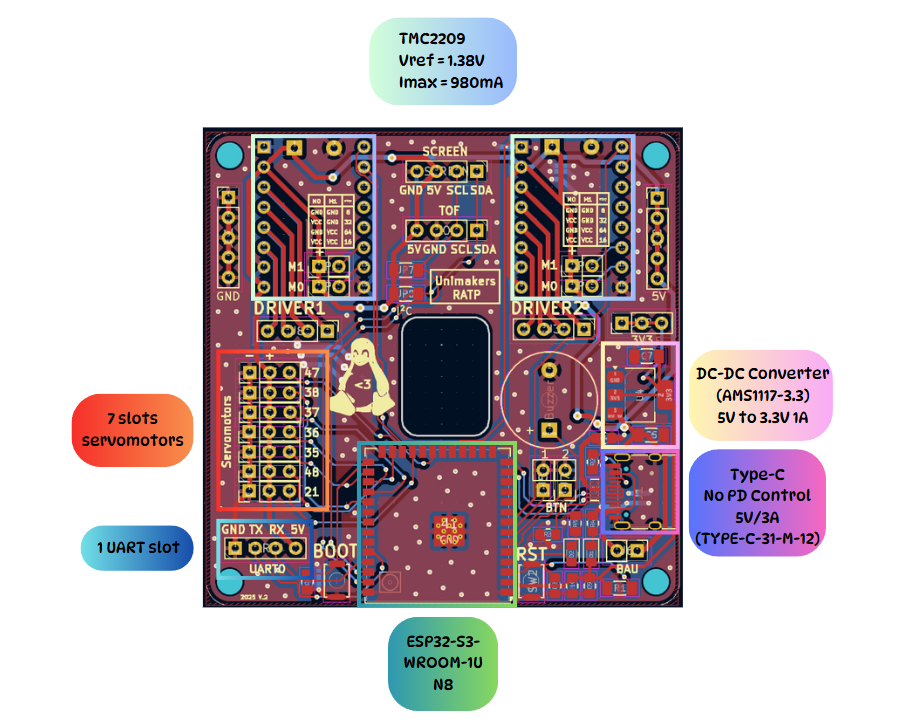
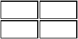

# PAMI Coupe de France 2025

Page des robots "PAMI" de l'équipe Unimakers RATP pour l'année 2025.

## 1. Carte électronique

Alimentation via une batterie externe pour téléphone permettant une tension de 5V et un courant de 3A.

Fonctionnalités :
- Buzzer
- UART
- Built-in LED
- Contrôle I²C : capteur ToF / écran OLED
- Contrôle de 2 moteurs pas à pas (NEMA 17)
- Contrôle jusqu'à 7 servomoteurs
- Boutons BOOT/RESET
- Bouton d'arrêt d'urgence (BAU)

Réalisation de la carte électronique avec KiCad.
https://github.com/TiTooom/PCBetes

###  Affichage écran OLED

    

Afficha des informations essentiels pendant le match, tel que :

- La distance de l'obstacle
- Le timer
- L'équipe actuelle
- et d'autres informations pour du debug

## 2. Structure

En cours de création...

## 3. Code

En cours de création...

## 4. Stratégie

En cours de création...